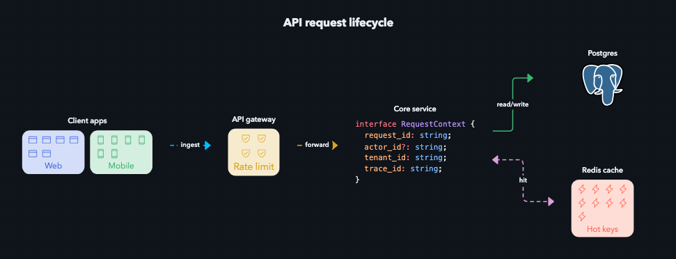
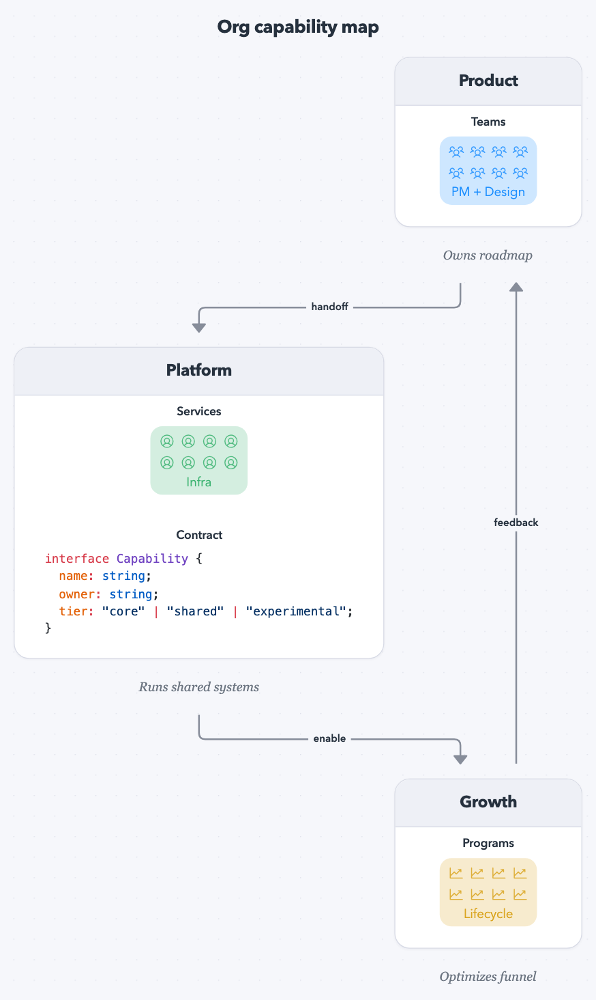

# diagr

diagr (pronounced dagger) renders diagrams from YAML using React Flow with built in light/dark mode.

**Example:**

- API request lifecycle diagram

  

  <details>
  <summary>Diagram config</summary>

  ```yaml
  title: "API request lifecycle"
  filename: "api-request-lifecycle"
  theme: "dark"

  edges: |
    client --> gateway [label="ingest", color="deepskyblue", type=dash]
    gateway --> service [label="forward", color="goldenrod"]
    service --> db [label="read/write", color="mediumseagreen", type=solid]
    service --> cache [label="warm", color="tomato", type=dot]
    cache --> service [label="hit", color="plum", type=dash]

  layout:
    direction: LR
    xGap: 110
    yGap: 80

  nodes:
    - id: "client"
      label: "Client apps"
      renderer: "cards"
      data:
        cards:
          - label: "Web"
            tone: "royalblue"
            icon: "browser"
            icons: 6
          - label: "Mobile"
            tone: "mediumseagreen"
            icon: "device-mobile"
            icons: 6

    - id: "gateway"
      label: "API gateway"
      renderer: "cards"
      data:
        cards:
          - label: "Rate limit"
            tone: "goldenrod"
            icon: "shield-check"
            icons: 4

    - id: "service"
      label: "Core service"
      renderer: "code"
      data:
        code: |
          interface RequestContext {
            request_id: string;
            actor_id?: string;
            tenant_id: string;
            trace_id: string;
          }

    - id: "db"
      label: "Postgres"
      renderer: "image"
      data:
        image: "https://upload.wikimedia.org/wikipedia/commons/2/29/Postgresql_elephant.svg"
        height: 80

    - id: "cache"
      label: "Redis cache"
      renderer: "cards"
      data:
        cards:
          - label: "Hot keys"
            tone: "tomato"
            icon: "lightning"
            icons: 9
  ```

  </details>

- Organization diagram

  

  <details>
  <summary>Diagram config</summary>

  ```yaml
  title: "Org capability map"
  filename: "org-capability-map"
  theme: "light"

  edges: |
    product --> platform [label="handoff"]
    platform --> growth [label="enable"]
    growth --> product [label="feedback"]

  layout:
    direction: TB
    xGap: 900
    yGap: 140

  nodes:
    - id: "product"
      label: "Product"
      renderer: "groupCard"
      data:
        caption: "Owns roadmap"
        ids: ["product_cards"]

    - id: "platform"
      label: "Platform"
      renderer: "groupCard"
      data:
        caption: "Runs shared systems"
        ids: ["platform_cards", "platform_code"]

    - id: "growth"
      label: "Growth"
      renderer: "groupCard"
      data:
        caption: "Optimizes funnel"
        ids: ["growth_cards"]

    - id: "product_cards"
      label: "Teams"
      renderer: "cards"
      data:
        cards:
          - label: "PM + Design"
            tone: "dodgerblue"
            icon: "users-three"
            icons: 8

    - id: "platform_cards"
      label: "Services"
      renderer: "cards"
      data:
        cards:
          - label: "Infra"
            tone: "mediumseagreen"
            icon: "server"
            icons: 8

    - id: "platform_code"
      label: "Contract"
      renderer: "code"
      data:
        code: |
          interface Capability {
            name: string;
            owner: string;
            tier: "core" | "shared" | "experimental";
          }

    - id: "growth_cards"
      label: "Programs"
      renderer: "cards"
      data:
        cards:
          - label: "Lifecycle"
            tone: "goldenrod"
            icon: "chart-line-up"
            icons: 8
  ```

  </details>

### Built-in renderers

- `cards` uses `data.cards` where each item supports:
  - `label` (string)
  - `icon` (any Phosphor icon name; kebab/snake/camel/pascal all supported, e.g. `hard-drive`, `cloud`, `CloudArrowDown`, `user_circle`)
  - `iconSize` (optional number, clamped to 12-48; defaults by variant)
  - `tone` (any CSS color value, including HTML color names)
  - `icons` (repeat count)
- `code` uses `data.code` (highlighted with Shiki)
- `image` uses `data.image` (blueprint fallback if empty), and supports optional `data.width` / `data.height` in px
- `markdown` uses `data.markdown` (safe built-in markdown rendering)
- `groupCard` is the container renderer

### Theme overrides

Theme overrides are authored as CSS in the Theme editor and scoped to `#diagr-diagram-canvas`.
Examples:

```css
.diagr-node-markdown h2 {
  color: #7aa2ff;
}

.diagr-group-header {
  letter-spacing: 0;
}
```

Full override reference: `/Users/dos/Documents/codex/diagr/docs/theme-overrides.md`


## CLI (alpha)

This is a work in progress and requires playwright.

Export diagrams as PNG with NPX:

```bash
npx diagr FILENAME [STYLE_OVERRIDE_FILE] [--output PATH] [--theme THEME]
```

Examples:

```bash
npx diagr ./diagram.yaml
npx diagr ./diagram.yaml ./theme-overrides.css
npx diagr ./diagram.yaml --output ./out/custom.png
npx diagr ./diagram.yaml ./theme-overrides.css --theme dark
```

Rules:
- PNG only.
- `--theme` is strict (`light` or `dark`).
- Output filename precedence: `--output` > YAML `filename` > input basename.
- Theme/style flags are export-time only and do not modify source files.